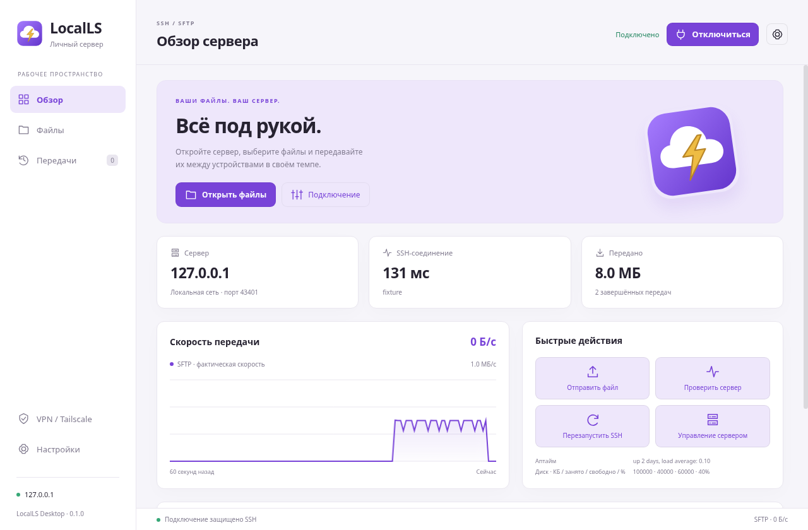

# LocalLS

Компактный SSH/SFTP-клиент для Android и Windows: две панели файлов, загрузка и скачивание,
история передач, график скорости, темы оформления и работа в фоне.
Общий значок — облако с молнией.



## Приложения и сборки

| Приложение | Версия | Система | Установочный файл |
| --- | --- | --- | --- |
| LocalLS Android | 0.9.3 | Android 7.0+ (minSdk 24) | `LocalLS-v0.9.3-debug.apk` |
| LocalLS Desktop | 0.1.0 | Windows 10/11 x64 | `LocalLS-0.1.0-Windows-x64-Setup.exe` |

APK и EXE размещаются в **Releases** этого репозитория отдельно от исходников.
Загрузка GitHub «Source code» содержит исходники; установочные файлы выбирайте в списке Assets.
Android APK подписан debug-сертификатом; Windows EXE пока без подписи издателя.
SHA-256 установщиков указан в `SHA256SUMS.txt` каждого релиза.

## Структура

- [`android/`](android/README.md) — Android 0.9.3, Gradle Wrapper, UI, SSH/SFTP, мастер Termux, тесты и документация.
- [`android/realme-agent/`](android/realme-agent/README.md) — существующий независимый агент управления SSH.
- [`desktop/`](desktop/README.md) — Windows-клиент 0.1.0 на Electron, установщик NSIS, тесты и значки.
- [`android/BUILD_REPORT.md`](android/BUILD_REPORT.md) и [`desktop/BUILD_REPORT.md`](desktop/BUILD_REPORT.md) — результаты настоящих сборок и выполненных проверок.
- [`docs/`](docs/) — сведения о проверке артефактов и скриншоты тестового интерфейса.

Android и Windows продолжают работать с существующим Termux/OpenSSH-сервером.
Windows 0.1.0 — клиент; создание сервера на ПК в этой версии не реализовано.
VPN использует установленный официальный Tailscale, собственный VPN-сервис не встроен.
Приложения не добавляют конкурирующий механизм запуска sshd.

## Сборка из исходников

Android: JDK 17, Android SDK Platform `android-37.0`, Build Tools 36.0.0,
Platform Tools и официальный Gradle Wrapper 9.6.0 (AGP — в build.gradle.kts).
Настройте `ANDROID_SDK_ROOT` или собственный `android/local.properties`.

```sh
cd android
python3 tools/audit_project.py
./gradlew clean assembleDebug
```

Windows: Node.js 24 и npm. Сборка создаёт установщик в `desktop/artifacts/`.

```sh
cd desktop
npm ci
npm test
npm run build:win
node tools/verify-package.cjs
```

Подробности сборки, UI smoke test и ограничения реальных устройств — в README и BUILD_REPORT
соответствующего приложения. Linux UI-проверки Windows-клиента не означают тест на Windows.

## Сохранённые версии

Теги `android-v0.8`, `android-v0.9`, `android-v0.9.1`, `android-v0.9.2`,
`android-v0.9.3` и `windows-v0.1.0` содержат сохранившиеся снимки исходников.
История импортирована из этих снимков при подготовке репозитория; это не восстановленная
история всех отдельных правок. Прежние Android-версии доступны по тегам и в Releases.
Исходная рабочая v0.8 сохранена; дальнейшие планы v1.0 находятся в документации приложений.

## Безопасность и права

Пароли, токены, ключи подписи, приватные профили, журналы устройств, кэши и зависимости
не входят в репозиторий. Первый SSH-вход требует проверки ключа; изменившийся ключ
блокирует авторизацию. Тестовые ключи и пароли в тестах генерируются во время запуска.

Лицензия для исходников пока не выбрана. Публичное размещение само по себе не выдаёт
разрешение на распространение и модификацию; лицензии зависимостей принадлежат их авторам.
